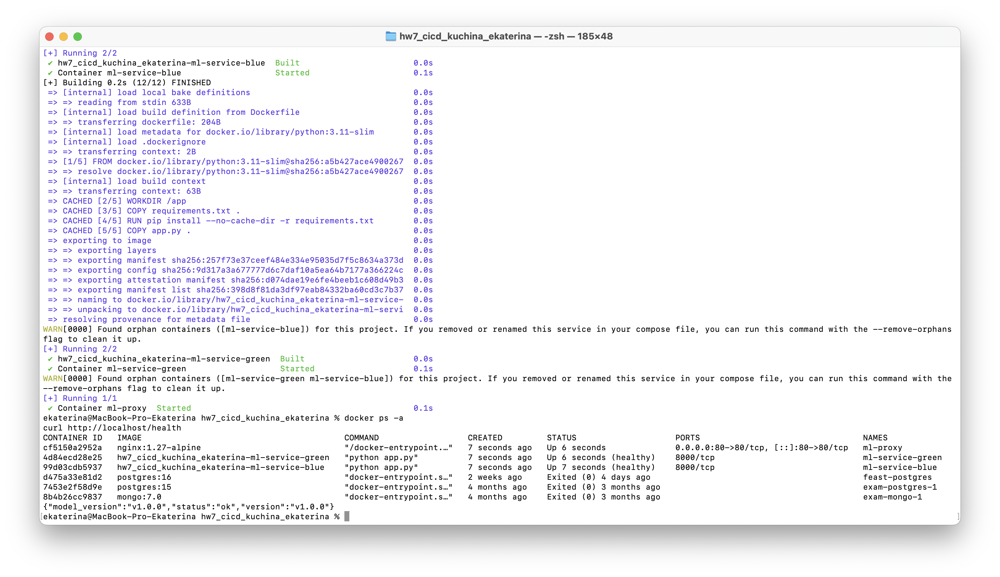
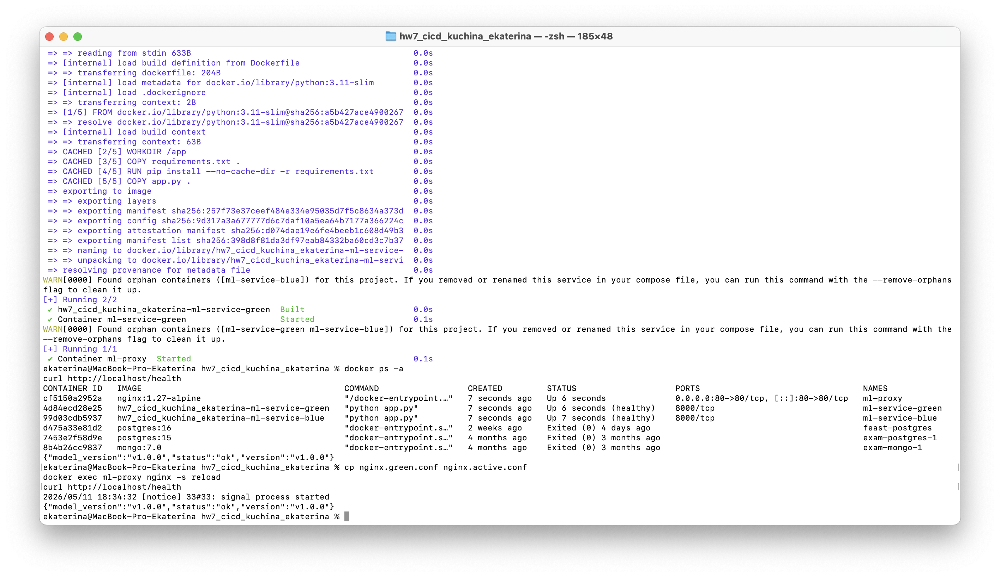
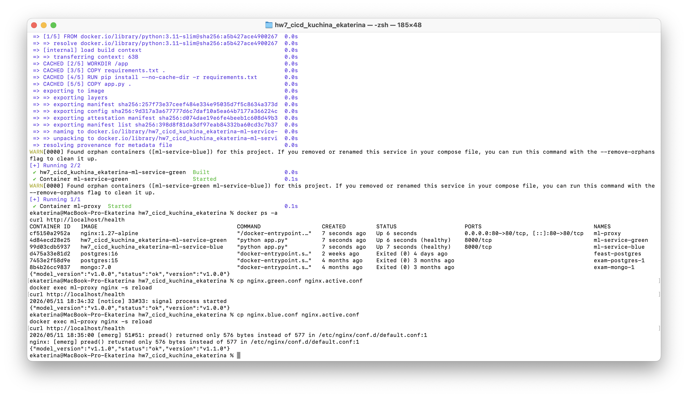
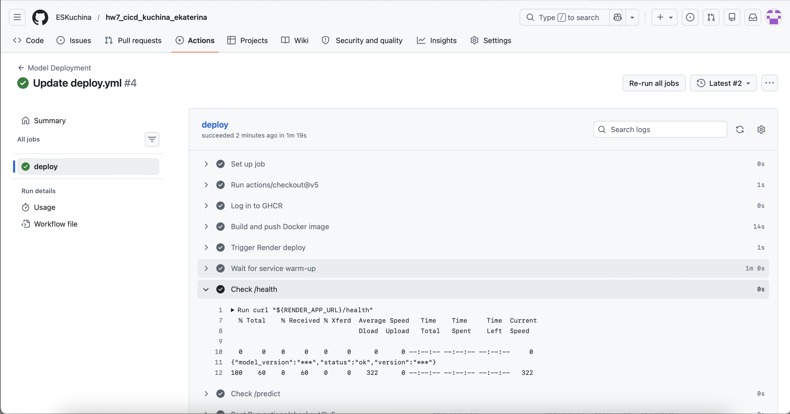
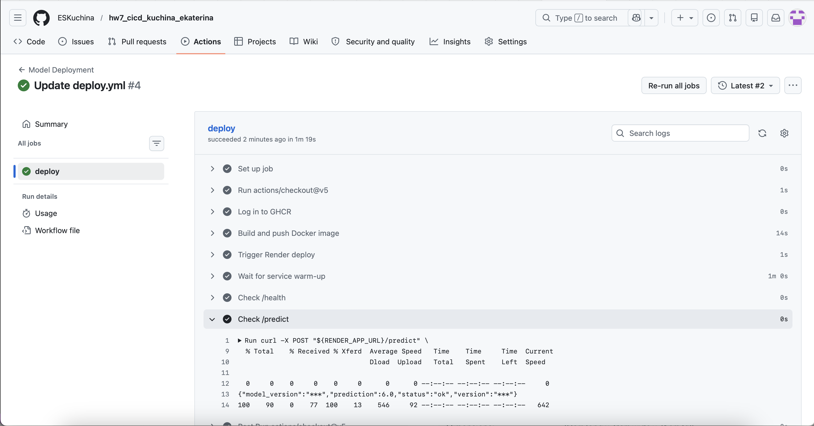

# hw7_cicd_kuchina_ekaterina

## О проекте

В проекте реализована стратегия **Blue-Green Deployment** для ML-сервиса.

- **Blue** — стабильная версия `v1.0.0`
- **Green** — новая версия `v1.1.0`

Для переключения трафика используется **Nginx**.  
Дополнительно в репозитории настроены workflow **GitHub Actions** для проверки ML-пайплайна и для деплоя.

## Состав файлов

- `docker-compose.blue.yml`
- `docker-compose.green.yml`
- `docker-compose.proxy.yml`
- `nginx.blue.conf`
- `nginx.green.conf`
- `nginx.active.conf`
- `app.py`
- `requirements.txt`
- `Dockerfile`
- `ml_pipeline.py`
- `requirements-ml.txt`
- `.github/workflows/ci.yml`
- `.github/workflows/deploy.yml`

## Локальный запуск

### 1. Создать сеть

```bash
docker network create ml-net
```

### 2. Поднять blue и green

```bash
docker compose -f docker-compose.blue.yml up -d --build
docker compose -f docker-compose.green.yml up -d --build
```

### 3. Поднять прокси

```bash
docker compose -f docker-compose.proxy.yml up -d
```

## Проверка стратегии Blue-Green

### Проверка blue-версии

```bash
curl http://localhost/health
```

Ожидаемый ответ:

```json
{"status":"ok","version":"v1.0.0","model_version":"v1.0.0"}
```

### Переключение трафика на green

```bash
cp nginx.green.conf nginx.active.conf
docker exec ml-proxy nginx -s reload
curl http://localhost/health
```

Ожидаемый ответ:

```json
{"status":"ok","version":"v1.1.0","model_version":"v1.1.0"}
```

### Rollback на blue

```bash
cp nginx.blue.conf nginx.active.conf
docker exec ml-proxy nginx -s reload
curl http://localhost/health
```

Ожидаемый ответ:

```json
{"status":"ok","version":"v1.0.0","model_version":"v1.0.0"}
```

### Проверка `/predict`

```bash
curl -X POST http://localhost/predict \
  -H "Content-Type: application/json" \
  -d '{"x":[1,2,3]}'
```

Ожидаемый ответ:

```json
{"status":"ok","version":"v1.0.0","model_version":"v1.0.0","prediction":6.0}
```

## GitHub Actions

Workflow-файлы находятся в каталоге:

```text
.github/workflows/
```

### `ci.yml`

Workflow для проверки ML-пайплайна и воспроизводимости запуска.

Что делает:
- устанавливает Python 3.11;
- устанавливает зависимости из `requirements-ml.txt`;
- запускает `ml_pipeline.py`;
- сохраняет сведения о воспроизводимости:
  - версию Python,
  - сохраненные зависимости,
  - список установленных пакетов,
  - контрольные суммы ключевых файлов;
- публикует артефакты выполнения.

### `deploy.yml`

Workflow для деплоя модели.

Что делает:
- собирает Docker-образ;
- публикует его в GitHub Container Registry (GHCR);
- запускает деплой через Render Deploy Hook;
- выполняет проверку `/health`;
- выполняет проверку `/predict`.

### Secrets и variables GitHub

Для работы `deploy.yml` используются:

**Secrets**
- `MODEL_VERSION`
- `RENDER_DEPLOY_HOOK_URL`

**Variables**
- `RENDER_APP_URL`

### Запуск workflow

Workflow можно запускать:
- автоматически при `push` в ветку `main`;
- вручную через вкладку **Actions**, так как в `deploy.yml` добавлен `workflow_dispatch`.

## Скриншоты проверки стратегии Blue-Green

### 1. Проверка blue-версии



### 2. Проверка green-версии после переключения трафика



### 3. Проверка rollback на blue-версию



### 4. Проверка `/predict` на blue-версии


### 5. Проверка `/predict` на green-версии


## Скриншоты после успешного деплоя

### 6. Проверка `/health` после успешного деплоя



### 7. Проверка `/predict` после успешного деплоя


