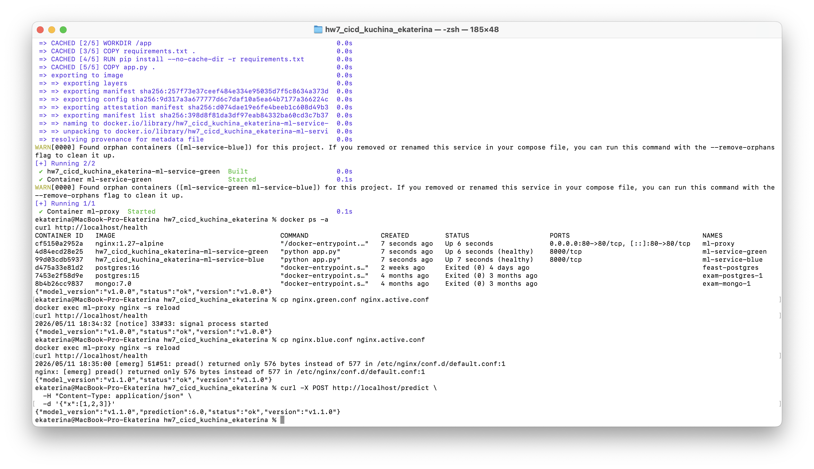
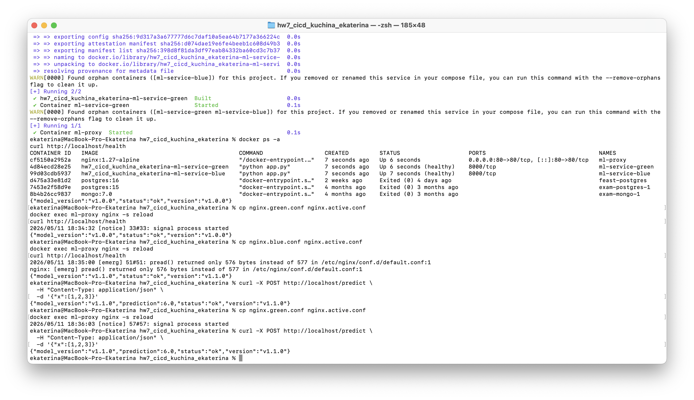

# hw7_cicd_kuchina_ekaterina

## Стратегия деплоя

В проекте реализована стратегия **Blue-Green Deployment** для ML-сервиса.

- **Blue** — стабильная версия `v1.0.0`
- **Green** — новая версия `v1.1.0`

Для переключения трафика используется **Nginx**.

## Состав файлов

- `docker-compose.blue.yml`
- `docker-compose.green.yml`
- `docker-compose.proxy.yml`
- `nginx.blue.conf`
- `nginx.green.conf`
- `nginx.active.conf`
- `app.py`
- `requirements.txt`
- `Dockerfile`

## Локальный запуск

### 1. Создать сеть

```bash
docker network create ml-net
```

### 2. Поднять blue и green

```bash
docker compose -f docker-compose.blue.yml up -d --build
docker compose -f docker-compose.green.yml up -d --build
```

### 3. Поднять прокси

```bash
docker compose -f docker-compose.proxy.yml up -d
```

## Проверка

### Blue

```bash
curl http://localhost/health
```

Ожидаемый ответ:

```json
{"status":"ok","version":"v1.0.0","model_version":"v1.0.0"}
```

### Переключение на Green

```bash
cp nginx.green.conf nginx.active.conf
docker exec ml-proxy nginx -s reload
curl http://localhost/health
```

Ожидаемый ответ:

```json
{"status":"ok","version":"v1.1.0","model_version":"v1.1.0"}
```

### Rollback на Blue

```bash
cp nginx.blue.conf nginx.active.conf
docker exec ml-proxy nginx -s reload
curl http://localhost/health
```

## Проверка predict

```bash
curl -X POST http://localhost/predict \
  -H "Content-Type: application/json" \
  -d '{"x":[1,2,3]}'
```

Ожидаемый ответ:

```json
{"status":"ok","version":"v1.0.0","model_version":"v1.0.0","prediction":6.0}
```
## Скриншоты проверки стратегии Blue-Green

### 1. Проверка blue-версии


### 2. Проверка green-версии после переключения трафика


### 3. Проверка rollback на blue-версию


### 4. Проверка `/predict` на blue-версии



### 5. Проверка `/predict` на green-версии

